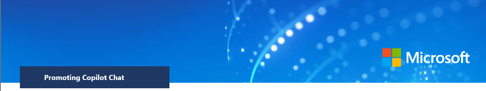
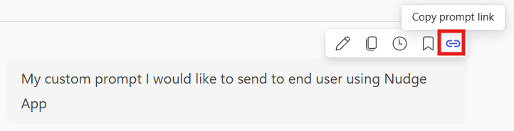
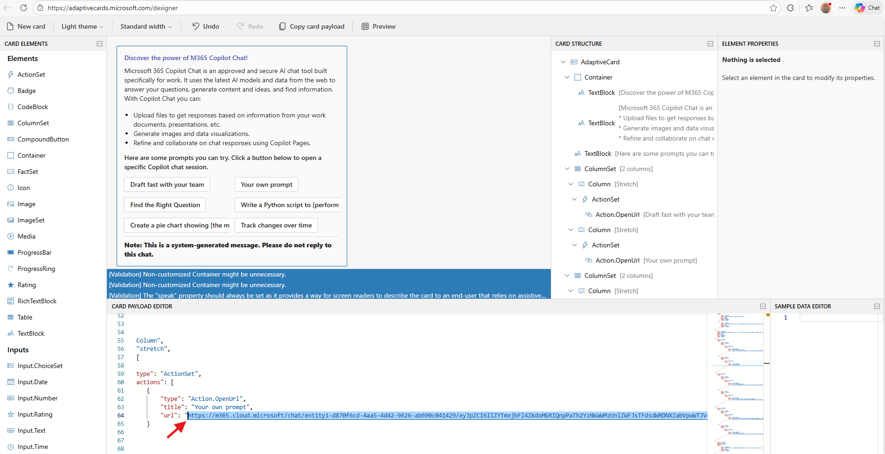
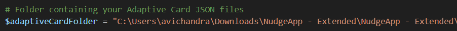
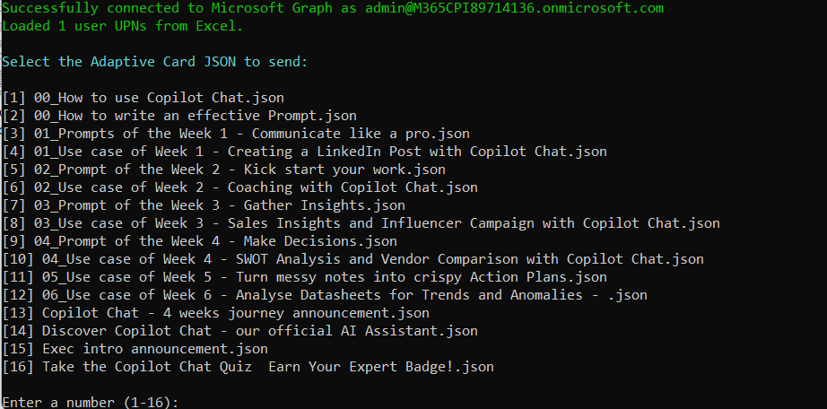

# Promoting Copilot Chat

## Audience

This guide is intended for **IT administrators and Change Management teams** in charge of user adoption for new tools in Microsoft 365 (in this case, the Copilot Chat app). It provides a strategy and technical steps to promote a newly available feature (Copilot Chat) to a large number of users efficiently and safely.

---
## Promoting Awareness for the Newly Pinned Copilot Chat App

**Microsoft 365 Copilot Chat** is your AI assistant, built right into Microsoft 365—at no extra cost. It is designed to help everyone in your organization use AI naturally in their flow of work—whether they need quick info, a starting point, or a creative boost. And because it is part of Microsoft 365, it is built on security you can trust.
Now that Copilot Chat is pinned and easy to find, it is the perfect time to spread the word.

IT Admins and Change Management teams can use the Nudge App to prompt users with a friendly message like, `“Hey, try Copilot Chat! Just type your request in the prompt and get started.”` This simple nudge helps users quickly discover how powerful—and helpful—Copilot Chat can be.

---
## Available Options

* ### Script-based Teams Nudge App

    ‼️Warning: The solutions from this repository are using prompts from the official Microsoft [Prompt Gallery](https://learn.microsoft.com/en-us/copilot/microsoft-365/copilot-prompt-gallery). These prompts may be removed from the Prompt Gallery when you start using the solution. We highly recommend that you customize the Adaptive Card messages with the prompts from the Gallery or you own prompts. See the 'How to customize the Teams messages ?' for more information.

    [This document](https://github.com/luishdemetrio/copilot_chat_promotion/blob/main/NudgeApp/Copilot%20Nudge%20App%20Documentation.pdf) provides guidance on deploying a PowerShell script that sends Adaptive Card messages to users in Microsoft Teams. The script uses the Microsoft Graph API for communication, and it employs parallel processing to work efficiently while reducing file input and output operations. 

    The Adaptive Card, which is central to the script, contains six buttons. Each button corresponds to a specific prompt. When a user clicks on a button, the card triggers an action that opens a new browser tab. The chosen prompt is automatically copied into a dialog box in the browser. 

    The user can then review the prompt, make edits to modify it if needed, and click a "Send" button to execute the prompt. This interactive design allows users flexibility to tailor the prompt before sending. 

    More details at: [PowerShell Instructions](https://github.com/luishdemetrio/copilot_chat_promotion/blob/main/NudgeApp/PowerShell%20Teams%20Message%20Script%20Documentation.docx)

 *  #### How to customize the Teams messages ?

    The messages provided within the solution are using [Adaptive Card open source technology](https://adaptivecards.io/).
    You can customize with you own messages using the [Adaptive Card designer](https://adaptivecards.microsoft.com/designer) and saving the JSON as a file within the solution.
    Have a look at the [Copilot Nudge App Documentation](https://github.com/luishdemetrio/copilot_chat_promotion/blob/main/NudgeApp/Copilot%20Nudge%20App%20Documentation.pdf) to adapt the script and send the message you want. (#Path to the Adaptive Card JSON)

    If you want to send message with buttons launching your own prompts, you can run a prompt in Microsoft Copilot from a user in the tenant and copy past the link inside of the Adaptive Card massage:

*   #### Nudge App - Extended

    This version handles a library of messages instead of a single Adaptive Card message to provide to the script. It provides two libraries:
    
    -One including prompt links (Library)

    -One only showing the prompts to copy paste (Library - no prompt links)

    For this solution you will need to customize the '#Folder containing your Adaptive Card JSON files' with the library path in the script.

    When you run the script, after authentication, it will show you the list of Adaptive Card messages in that library folder. You will then be able to pick the one your want from the audience you are targeting.

*   #### Overall recommendations 
    
    -Use a service account with a friendly name for your audience to authenticate and send the messages (E.g. Copilot Nudges), this account must have a Teams license to send the messages
    
    -Customize & Brand your Adaptive Card layout using [Adaptive Card Designer](https://adaptivecards.microsoft.com/designer). You can add your logo and branding colors.

* ### Agent-based Nudge App (automated)

    Coming soon

### 🤝 Contributing

We welcome contributions! 

- Code standards and conventions
- Pull request process
- Issue reporting
- Feature requests

### 🙋 Support

- [Feedback & Issues](https://github.com/luishdemetrio/copilot_chat_promotion/issues)
