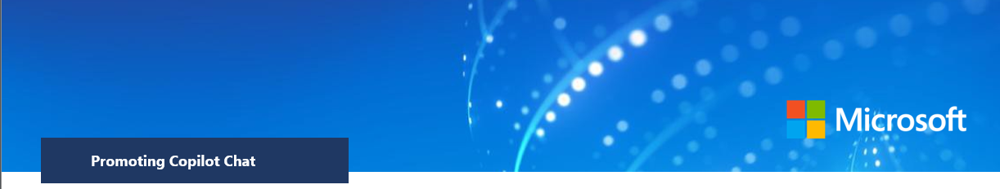
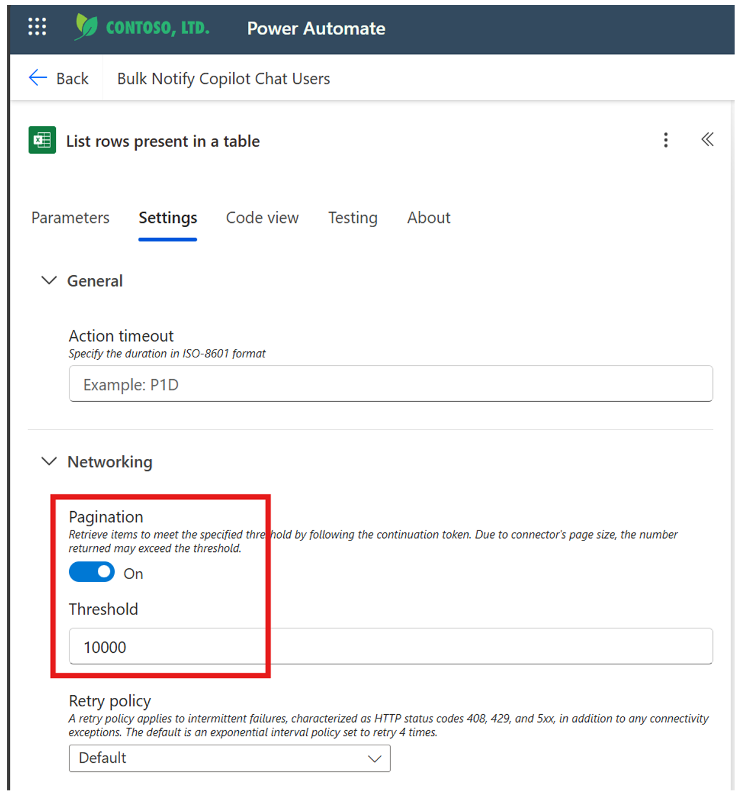
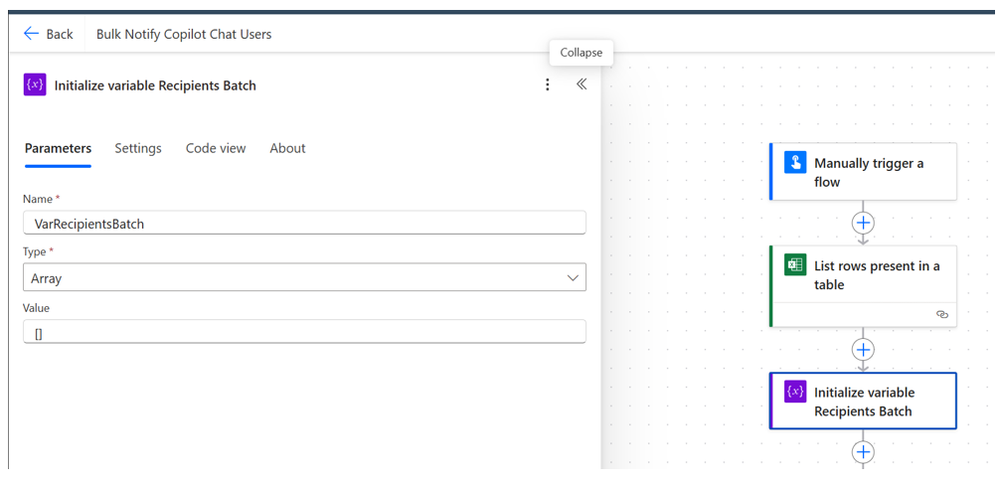

# Promoting Copilot Chat



## Bulk Notification Strategy and Flow Design

### Disclaimer

The information contained in this document represents the current view of Microsoft Corporation on the issues discussed by the date of publication. Given that Microsoft must respond to changing market conditions, it should not be interpreted as a commitment on the part of Microsoft, and Microsoft cannot guarantee the accuracy of any information presented after the date of publication.

MICROSOFT MAKES NO WARRANTIES, EXPRESS, IMPLIED, OR STATUTORY, AS TO THE INFORMATION IN THIS DOCUMENT.

Compliance with all applicable copyright laws is the responsibility of the user. Without limiting the rights under copyright, no part of this document may be reproduced, stored in, or introduced into a retrieval system, or transmitted in any form or by any means (electronic, mechanical, photocopying, recording, or otherwise), or for any purpose, without the express written permission of Microsoft Corporation.

Microsoft may have patents, patent applications, trademarks, copyrights, or other intellectual property rights covering the subject matter of this document. Except as expressly provided in any written license agreement from Microsoft, the furnishing of this document does not give you any license to these patents, trademarks, copyrights, or other intellectual property.

Descriptions of other companies' products in this document, if there are any, are provided only as a convenience to you. Microsoft cannot guarantee their accuracy, and the products may change over time. Also, the descriptions are intended as brief summaries to aid understanding, and they do not cover every aspect of the products. For detailed information about other companies' products, please consult their respective manufacturers.

© 2025 Microsoft Corporation. All rights reserved. Unauthorized use or distribution of these materials is prohibited without the express permission of Microsoft Corporation. Microsoft and Windows are registered trademarks of Microsoft Corporation in the United States and/or other countries. The names of actual companies and products mentioned herein may be the trademarks of their respective owners.

## Table of Contents

- [Audience](#audience)
- [Introduction & Campaign Context](#introduction--campaign-context)
- [Bulk Messaging Feasibility (Outlook Email vs Teams)](#bulk-messaging-feasibility-outlook-email-vs-teams)
- [Throttling Limits and How We Avoid Them](#throttling-limits-and-how-we-avoid-them)
- [Step-by-Step: Power Automate Flow Implementation](#step-by-step-power-automate-flow-implementation)
- [Appendix](#appendix)

## Audience

This guide is intended for **IT administrators and Change Management teams** in charge of user adoption for new tools in Microsoft 365 (in this case, the Copilot Chat app). It provides a strategy and technical steps to promote a newly available feature (Copilot Chat) to a large number of users efficiently and safely.

## Introduction & Campaign Context

**Microsoft 365 Copilot Chat** is a new AI assistant integrated into the Microsoft 365 suite, designed to help users with everyday tasks **at no additional cost** and with **enterprise-grade security and privacy**. Recently, Copilot Chat has been conveniently **pinned by default** in the Microsoft 365 app bar, making it more visible to users. Copilot Chat can assist with things like drafting emails, answering questions, summarizing documents, and more, all within the user's normal workflow.

To ensure employees are aware of Copilot Chat and start using it, IT and Change Management have launched a promotion campaign with multiple channels:

- **Introduction to Copilot Chat:** In communications, highlight what Copilot Chat is and its benefits: it's easy to use (just click the Copilot icon and start chatting), it can save time by providing AI-powered assistance, and it's already included in our tools (so no extra setup or cost).

- **Email Announcements:** Many users respond well to email, so an official announcement email will be sent. This email serves as a guide and nudge in itself -- explaining Copilot Chat, how to access it (e.g., "Look at the left sidebar, you'll see the Copilot icon..."), and perhaps linking to a short internal demo or FAQ for more information.

- **Organized User List (Excel):** To manage the outreach, IT collected a list of target users in an Excel file. These might be all users in the org or a subset (for example, an opt-in early adopters' group or those licensed for Copilot if it was in preview). The Excel file ensures we have the correct recipients and can track who's included. It will be used as input for email-sending automation.

- **Automating Notifications (Power Automate):** Instead of manually emailing thousands of users, a Power Automate flow will automate the process. This ensures consistency of the message and reduces manual effort and error. The flow is designed to handle a large volume of recipients while respecting service limits (to avoid being throttled or flagged as spam).

- **Testing and Follow-up:** Before the full send, the process is tested with a small group to catch any issues. After the announcements, the team can monitor Copilot Chat usage and user feedback. If necessary, additional follow-up communications or training can be provided to drive adoption.

**Why 5,000 users?** In our scenario, we use **5,000 users as an example audience size** for planning purposes. This is a manageable chunk that fits well within certain system limits we'll discuss. However, the approach described can scale beyond 5,000 users -- we'll address how to handle larger distributions in a later section. The key is to ensure our method aligns with Microsoft's sending limits and best practices, regardless of audience size.

## Bulk Messaging Feasibility (Outlook Email vs Teams)

We need to reach thousands of users with our Copilot Chat announcement. There are two main Microsoft 365 channels we considered for direct messages: **Outlook email** and **Teams chat**. Here's how they compare to this scenario:

### Outlook Email
Sending an email is a reliable way to deliver a detailed message to users. Exchange Online (which backs Outlook email) is designed to handle mass emails within certain limits. In fact, a single email can be addressed to many recipients at once (using the BCC field or a distribution list). Per Microsoft's guidelines, **Exchange Online allows up to 10,000 recipients per mailbox in a 24-hour period**, and up to 500 recipients per single email by default (this single-email limit can be raised to 1,000 with admin configuration). Our scenario of 5,000 recipients in one day is well within the 10,000/day allowance. The challenge is ensuring we don't send 5,000 *separate* emails too quickly, which could hit sending rate limits -- but we have strategies to handle that (discussed in the next section on throttling). With email, users can read and reference the information at their convenience, and the message can be richly formatted (with images, links, etc.). It's an "official" communication channel that users expect for organizational announcements.

### Teams Chat
Sending a Teams chat message (or a Teams-based notification) to users is more immediate and integrated -- it can pop up on their screen like a message from IT. However, **Teams has strict throttling for automated messages**. The standard Microsoft Teams connector in Power Automate can send about **300 messages per hour** (roughly 5 per minute) for an individual flow or bot. Trying to send 5,000 individual chat messages would take many hours and likely hit those limits, causing delays or failures. Unlike email, there isn't a built-in way to send one message to a large list of individuals at once (there's no direct equivalent of BCC in chats). One could post in a Teams channel that all users are part of, but not everyone may be in a common team/channel, and those messages are less direct. For large broadcasts in Teams, Microsoft provides the **Company Communicator** app or similar solutions -- but those require additional setup and are beyond our current scope. Given the urgency and one-time nature of this announcement, setting up such an app might be overkill.

### Decision
We chose to use **Outlook email as the primary channel** for the bulk notification. It's the most feasible method to contact 5,000 users quickly. Each approach has pros/cons, but for our purposes:

- **Email** can reach all targeted users in one go, with a rich message, and our plan ensures it stays within limits.
- **Teams** chats for thousands of users would likely be delayed or incomplete due to throttling, and users might find an unexpected chat message from an IT bot less familiar than an email from IT.


*Key sending limits for Outlook and Teams:* Exchange Online allows ~10k recipients per day and around 30 messages/minute, which our solution will respect. The Teams connector, in contrast, caps at 300 messages/hour, making it impractical for mass notifications of this size.

## Throttling Limits and How We Avoid Them

Whenever you send a large volume of messages, you must consider **throttling**, which is when the service intentionally slows down or blocks your requests because you're sending too much, too fast. Both Outlook/Exchange and Teams have throttling and limits in place:

### Outlook/Exchange Limits
Office 365 has limits to prevent spam and server strain. Important ones for our scenario:

- **10,000 recipients per day:** As mentioned, one mailbox can send to up to 10,000 recipients in 24 hours. If we tried to send to more than that, the service would stop us from sending more emails that day.

- **500 recipients per email:** By default, any single email can have up to 500 recipients (across To, CC, BCC combined). This is partly a safety factor; sending to an extremely large number of people in one email might trigger spam detectors or just be unwieldy. (This limit can be modified by admin, but we'll work within it.)

- **30 messages per minute (estimated):** Exchange also limits the rate of sending. While the exact rules aren't public, a commonly cited guideline is around 30 emails per minute from a single account before it starts queuing or throttling them. So if you attempt to send, say, 60 emails in one minute, some might be delayed or rejected.

- **Message size and content:** Large attachments or content could slow things down or trigger filters, but our scenario is just a text email with maybe a small image, so this isn't a big concern. Also, since it's an internal email, it's less likely to be flagged as spam compared to emailing external recipients.

### Teams Limits
For completeness, the Teams connector limit of ~300 messages/hour is a hard cap for automated flows. There are also limits on how many new chats can be started by a user or bot in a given timeframe, etc. But since we're not using chat for all 5,000, we won't delve deeper into Teams limits here. Just note that Teams is generally not meant for large one-way broadcast messages to individual users via automation (unless using special tools).

### Our Solution -- Batch and Conquer (Outlook)

To work within these limits, we designed our Power Automate flow to **batch the recipients into groups of 300 and send one email per batch** instead of one email per user. Here's why and how:

- Sending to **300 recipients per email** stays below the 500 recipients/email limit. We chose 300 as a round number well under 500 to allow some buffer (and because 5,000 / 300 = roughly 17 emails, which is a good number of batches). We could have possibly used 500, which would yield 10 emails, but using slightly smaller batches is conservative and ensures we won't hit any unseen limits (like if there's a size limit per email or if certain mail gateways have rules).

- By sending only ~17 emails in total to cover 5,000 people, we drastically reduce the send operations. Even if those 17 emails all went out back-to-back, that's far below 30 per minute, so Exchange won't throttle the sending. In practice, our flow will naturally have a tiny delay between batches (a second or two), so it might take maybe 1-2 minutes to send all 17 emails, which is well within safe limits.

- All 5,000 recipients still get the email, but they are divided among those 17 emails (all BCC'd). From the recipients' perspective, they just receive an email addressed to them (they don't see the other 299 people in BCC). From Exchange's perspective, we used only a fraction of our daily recipient quota (5,000 of 10,000) and we never had more than 300 in a single send.

- **Privacy:** Using BCC for all recipients means no one sees anyone else's email address on the list. This is important for GDPR/privacy and general respect (you wouldn't want to expose a list of users or emails in a big blast). It also prevents the dreaded "Reply All apocalypse" -- if someone accidentally hits Reply All (or if a confusion leads to many replying), it won't go to everyone, because the original email had them on BCC, not on To or CC. Replies will typically just go back to the sender.

- **Avoiding Spam flags:** Sometimes if you send a ton of individual emails rapidly, spam filters might raise an eyebrow. By sending a smaller number of larger emails, our pattern looks more like a normal newsletter or announcement blast (which Exchange is fine with internally). We also ensure our content is clearly work-related, not triggering any spam keywords.

- **Dedicated Sender:** We use a specific mailbox (e.g., an IT communications or no-reply mailbox) to send these emails. This way, if any throttling were to occur or if a limit is hit, it doesn't affect someone's personal mailbox. It also means if users reply with questions, those replies go to a monitored, shared inbox rather than one person.


By implementing batching, we **completely avoid hitting the major throttling thresholds**. There's no point where we try to send more than 30 emails/minute, and there's no single email with more than 500 recipients. The daily total is exactly 5,000 recipients, which is half of the allowed 10,000. The result is that Exchange will deliver all our messages promptly without deferring or blocking any for quota reasons.

**What about Teams?** For completeness: if we had attempted Teams messages, we would have had to throttle our flow to maybe 5 messages/minute (to stay under 300/hour). To message 5,000 users, that would take **1,000 minutes**, i.e., about 16.6 hours, and that's if nothing went wrong. That's clearly not a good solution for a timely announcement. The Outlook method gets the job done in a couple of minutes.

## Step-by-Step: Power Automate Flow Implementation

Here's a detailed breakdown of how we constructed the Power Automate flow to send the bulk emails. We opted for a **manual-triggered flow** (run on-demand) since we want to control the timing of the announcement, but this could also be scheduled if needed.

### 1. Prepare the Excel File

Make sure the Excel file is in a location accessible by Power Automate (OneDrive for Business or SharePoint). The file should have a clear table structure:

- One column for the email address of each user (this is crucial).
- It can have other columns like Name, Department, etc., which can be used if you plan to personalize the email or just for record-keeping.
- Convert the list of users into an **Excel Table** (if it isn't already). Let's say we name the table **UserList** for reference. Having it as a table allows Power Automate to easily read all rows.

For example, we have a file **CopilotChat_Users.xlsx** with a table UserList that has a column **Email** (and maybe FirstName, LastName columns). It contains 5,000 rows, one per user.


### 2. Create the Flow (Manual trigger)

Go to Power Automate (https://make.powerautomate.com) and create a new **Instant cloud flow** (since we want to manually run it). Name it something like "Copilot Chat Announcement Email Blast".

- **Trigger:** Choose the trigger **Manually trigger a flow**. (No special inputs are needed, though you could parameterize the Excel file location or email subject if you wanted to reuse this flow for other emails in the future. In our case, we'll keep it fixed.)


We could also schedule it, but manual gives us control to execute exactly when the announcement is approved for send. We named it "Copilot Chat User Notification".


### 3. Excel - List Rows

Add a new step: **Excel Online (Business) -- List rows present in a table**.

- Select the "+" option below the first box, then search for **List rows present in a table** action

  
  
- Configure this action to point to your Excel file:
  - **Location**: OneDrive for Business (since that's where the file is).
  - **Document Library**: OneDrive (or if it were SharePoint, specify the site/doc library).
  - **File**: the path to our Excel (e.g., Marketing/Adoption/CopilotChatUserList.xlsx).
  - **Table**: the table name (e.g., Table1).
  
  

- Before moving on, click the "..." (ellipsis) on this action, go to **Settings**, turn **Pagination** on, and set the threshold to a number greater than 5000 (e.g., **10000**). By default, the List Rows action may only return the first 256 or 5,000 rows. Enabling pagination ensures it will retrieve all 5,000 users in our list.

- This action will output an array of all rows in the table. In subsequent steps, we'll refer to this array of users.

  

### 4. Initialize Variables

We'll use two variables to manage batching:

- **RecipientsBatch (Array)** -- to collect email addresses for the current batch.
- **BatchCount (Integer)** -- to count how many addresses have been added to the current batch.

Add two **Initialize variable** actions:

- Name: **RecipientsBatch**, Type: Array, Value: (leave blank, which means empty array). This will accumulate a batch of email addresses.

  
  
- Name: **BatchCount**, Type: Integer, Value: 0. This will count how many addresses are in the current batch.

  

### 5. Loop Through Users (Apply to each)

Add an **Apply to each** action. Set its input to the value of the rows from the Excel step (in Dynamic content, this might appear as List of Rows or value under the List Rows action).

This loop will iterate over each row (user) from the Excel file.


Inside this loop, add the following actions in order:

#### a. Append to array (RecipientsBatch):
Use **Append to array variable**, choose RecipientsBatch as the target array. For the value, select the user's email from the current row (e.g., dynamic content might show your Email column name, or you might see it as something like items('Apply_to_each')?['Email']). This adds the current user's email to our batch list.


#### b. Increment BatchCount:
Use **Increment variable**, choose BatchCount, and increment by 1. This tallies one more user added to the batch.


#### c. Check Batch Size (Condition):
Add a **Condition** control. We want to check if BatchCount has reached 300 (our chosen batch size). The condition can be configured as: **BatchCount is equal to 300**.

For clarity, rename this condition to something like "If batch is full (300)" (you can click the ... on the condition to rename it).

Now, this condition has two paths: **If yes** (BatchCount == 300) and **If no** (BatchCount != 300).


#### d. If Yes (Batch is full):
In the Yes branch (meaning we have 300 emails in our batch ready to send):


- **Send Email (Outlook):** We use **Office 365 Outlook -- Send an email (V2)**. In this action:
  - **To:** change it to dynamic and add a formula to set the value null (or we could put a single address like our IT mailbox for visibility; but not necessary, as BCC will carry the recipients).
  - **Subject:** set to our announcement subject, e.g., *"✨ Introducing Microsoft 365 Copilot Chat -- Your New AI Assistant"*. (We use a bit of excitement in the phrasing to catch attention.)
  - **Body:** we wrote a professional yet enthusiastic email body. It starts with a greeting, explains that Copilot Chat is now available and pinned for all users, and outlines a few key things it can do. We mention that it's included in our subscription (so they don't worry about trials or costs) and that it's easy to use. We encourage them to try asking Copilot something. We also mention they'll see helpful tips (nudges) in Teams as they work, which are part of this rollout. Finally, we provide a link to a SharePoint page with more info or a training video (for those who want to learn more) and contact info for support or feedback.

**Example Email Body:**

```
Hi,

We are leading in the responsible use of artificial intelligence (AI) to streamline our daily tasks and enhance productivity. **Microsoft 365 Copilot is an approved AI** tool available to all team members. It gives you the opportunity to use AI to create, summarize, and organize content.

**Copilot** is connected to your corporate Microsoft account and **provides a secure environment** to type prompts, copy and paste text, and upload documents. You will receive detailed responses in a conversational style. Simply ask a question and Copilot will reply.

**See what AI can do for you!**

You can access **Copilot Chat** in the desktop or web version of **Teams** and **Outlook** and on the web at https://m365copilot.com to get started.

Try different questions or commands to see how Copilot can help you! Here's some examples to get you started:

• Copy and paste meeting notes into Copilot and ask for a summary, actions items, or a to-do list.
• Summarize the Sustainability report in a few sentences.
• Ask Copilot to write a thank you note to a coworker or customer.
• Upload a document or copy and paste content into Copilot and ask if the communication is accessible to users who need assistive devices.

**Go deeper** Learn more about **Copilot** and the **Microsoft Copilot AI** productivity tools available. See examples of prompts to use here [Copilot Prompt Gallery](https://copilot.cloud.microsoft/prompts/all?products/name=CWC&createdBy=CreatedByAll).
```

   

  - We kept the email short and visually clear (some bold highlights, maybe bullet points for key benefits). No attachments (to avoid size issues), but we did include an image of the Copilot icon in the app bar for reference -- embedded inline.
  - **BCC:** we insert an expression `join(variables('VarRecipientsBatch'), ';')` to join the 300 email addresses into one string separated by semicolons (the format Outlook expects for multiple recipients in one field).
  
    
    
  - **From (Send As):** we configured the connection to send as the IT Communications mailbox, so this email comes from a recognizable IT sender.

Double-check everything: particularly that the BCC field has the joined addresses expression. This is crucial.

- **Reset Batch Variables:** After sending the email, we need to clear our batch for the next set of recipients:
  - Add **Set variable** action for RecipientsBatch, and set it to an empty array `[]`.
  
    
     
  - Add **Set variable** for BatchCount, set value to 0.
    
    
    
These steps ensure that on the next iteration, we start building a fresh batch.

Thus, every time we hit 300 users, the flow sends one email to those 300 and resets to gather the next 300.

#### e. If No (Batch not full yet):
In the No branch of the condition (BatchCount != 300), we don't need any action. It just means keep looping until we either fill the batch or run out of users.

This completes the loop setup.

### 6. Final Batch Send:

When the loop finishes, it's very likely that the last batch has fewer than 300 users (unless the total number of users was exactly a multiple of 300). In our example of 5,000:

- 5,000 / 300 = 16 remainder 200, so the last batch will have 200 users.

Those 200 would have been added to RecipientsBatch but never sent, because the condition "equals 300" never triggered for them.

We need to handle this outside the loop. After the Apply to each, add a **Condition** (or a simple check) to see if BatchCount is greater than 0. (Meaning there are some users collected in the batch that haven't been sent yet.)

If **BatchCount > 0** (true branch):


- Add another **Send an Email (V2)** action, configured the same way as above (BCC = join(RecipientsBatch, ';'), same Subject and Body). This will send to the remaining users (200 in our case).

  
  
- Then set RecipientsBatch and Batch Count to empty/0 again (not strictly necessary at the very end, but good practice).

  

### 7. Run the Flow and Monitor

Save your flow. Before running on all 5,000, it's smart to do one more dry run test:

- **Testing with a Subset:** You can create a copy of your Excel file with just, say, 10 or 20 emails (perhaps just your team), and point the flow to that test file/table (or add a condition in the loop like "if email = your address or a few known ones" for testing). Run the flow and verify that it sends an email to that small list correctly. Check that the BCC field had all those addresses and the formatting is good.

- If all looks good, reconfigure back to the full file and run the flow for real. From the Power Automate page, you can select the option **Run** to run the flow.

  

You can see the result of the flow and its status.


When running for 5,000 users:

- The flow will iterate and send out batches. You can watch the run progress in Power Automate. It might show 17 iterations of the condition branch (for each email sent).
- Check the mailbox's Sent Items after the flow completes. You should see the emails that were sent, each with up to 300 BCC addresses. That's a quick way to verify no one was missed and to see the final formatting as it went out.

Typically, this flow should complete in a minute or two and all emails will be on their way. Since it's using Exchange Online internally, delivery to internal mailboxes is usually within a minute as well. So within a few minutes, all 5,000 users will have the email in their inbox.


### Scalability Considerations -- Beyond 5,000 Users

In our scenario we used 5,000 users as a target group, partly because some Power Automate plans have limits around that number for loop iterations, and because it's within the easy range of email limits. However, what if you need to contact **more than 5,000 users**?

#### Power Automate Limits:
A standard Office 365 (E3/E5) or Power Automate per-user plan can handle well above 5,000 iterations in a flow (actually up to 100,000 items in a loop). The older free or seeded plans might have a 5,000 item limit per 15 minutes of flow run, but our flow, even if it had 10,000 users, would still likely be fine as it's just data processing and sending. So the flow can scale to 10k or more users as long as we manage the email sending appropriately.

If you were using a completely free plan (which is unlikely in an enterprise scenario), you might have a lower cap on flow complexity -- but in such cases, splitting the list or upgrading the plan would be the solution.

#### Email Limits for Larger Numbers:
Exchange Online's **10,000 recipients/day per mailbox** is the main ceiling for one account. If you need to notify, say, 20,000 users:

- The simplest approach is to **split across days**. For example, send to 10,000 users on Day 1 and the remaining 10,000 on Day 2. This way, each day you stay within the 10k/day limit for that mailbox.
- Our flow could be re-run with different segments of the list. You could add a filter in the Excel (like a column "Group A" or "Group B") and run one day for Group A, next day for Group B. Or use two separate Excel files each under 10k.
- Alternatively, if timing is critical to do all at once, you could use **multiple sender accounts** in parallel. For example, have two flows (or one flow twice) where one uses mailbox A to send to 10k users and mailbox B to send to another 10k at the same time. This essentially doubles the throughput. Coordination is needed to ensure each user only gets one email (so you'd have to split the list between the accounts). This is more complex and usually not necessary unless you have a very large org and need everyone emailed immediately.
- **Distribution Lists / Dynamic Distribution:** If this is a communication that will happen regularly to all employees, another strategy is to use Exchange Distribution Lists or Microsoft 365 Groups. For instance, an "All Employees" distribution list can be mailed with one email and Exchange will fan it out to all members (even tens of thousands). The advantage is Exchange handles the heavy lifting, and you don't need to loop through everyone in Power Automate. The reason we didn't use that here is because we wanted to target a specific subset and have more control, and not every org has an up-to-date all-user list readily available to use. But for scalability, it's worth noting that emailing a large static group can be done with one send if such a group exists. In our case, we opted for the Excel-driven approach for flexibility and filtering (and possibly because not everyone in the org is getting this, maybe just licensed users or similar).

#### Reusing and Scheduling:
Our flow can be run on demand, but if you needed to run it routinely (say a reminder each month to thousands of users), you might schedule it to run nightly or weekly but with logic to pick a subset each time if needed (to avoid blasting everyone daily). In the Copilot Chat context, we likely won't resend the same announcement to all 5,000 users unless there's a major update. We might use a similar flow for other communications though.

#### Upper Bound Thoughts:
To give an idea, with coordination, even reaching something like 50,000 users is possible by splitting into 5 segments of 10k on different days (or different senders). This is admittedly pushing the system -- at that scale, one might consider more specialized mass email tools or ensure Exchange limits are adjusted -- but it's doable within Microsoft 365 if planned. However, every environment has to abide by the fundamental limits (10k/day/account, etc.), so our recommendation for very large audiences is to break it up rather than trying to cram it in one go.

#### In Our Case:
5,000 was a comfortable number chosen for this campaign because it fits well under limits and might correspond to, say, a pilot phase or a particular region of the company. If Copilot Chat later rolls out to all 15,000 users in the company, we'll simply reuse this flow and run it in batches (e.g., 7,500 one day, 7,500 the next) or use two accounts concurrently. The approach doesn't fundamentally change -- batch sending is still key -- we just execute it in phases.

To summarize, **the number 5,000 was not a hard cap but a scenario choice** to ensure we operate within known safe limits. The solution can expand to larger user counts by segmenting the sends over time or across senders. By repeating the flow on different days (or with different segments), you can reach a much larger total audience while still respecting the per-day and per-message quotas. This way, whether it's 5,000 or 50,000 users, your message will get delivered reliably without overwhelming the system.

## Conclusion

By combining a strong communication strategy with a thoughtfully designed Power Automate flow, we successfully promoted the Copilot Chat app to our users:

- We delivered a compelling, informative message **through multiple channels (email + Teams nudges)** without spamming or overwhelming users.
- We navigated technical constraints by using **batch email sending**, ensuring the announcement reached everyone promptly **within service limits**.
- Our approach is repeatable and scalable for future communications, and it provides a blueprint for similar adoption campaigns (where you need to educate users about a new feature or service).
- Early results show increased awareness and usage of Copilot Chat, setting the stage for improved productivity as users integrate this AI tool into their daily work.

This case demonstrates how IT teams can leverage automation to efficiently handle large-scale communications, freeing them to focus on crafting the right message and supporting users, rather than the mechanics of sending messages. With the groundwork laid out above, promoting the next big feature (or sending any large notification) should be a smoother, faster process.

Happy automating, and enjoy the benefits of Copilot Chat!

## Appendix


### Reference Links:

1. https://learn.microsoft.com/en-us/copilot/microsoft-365/pin-copilot
2. https://aka.ms/Copilot/CopilotChatUserOnboardingTemplates
3. https://copilot.cloud.microsoft/en-GB/prompts/all?ocid=CopilotLab_HM_PromptsToTry&products%2Fname=CWC&createdBy=CreatedByAll and https://aka.ms/CopilotChatUserDeck
4. https://aka.ms/CopilotChatSuccessKit